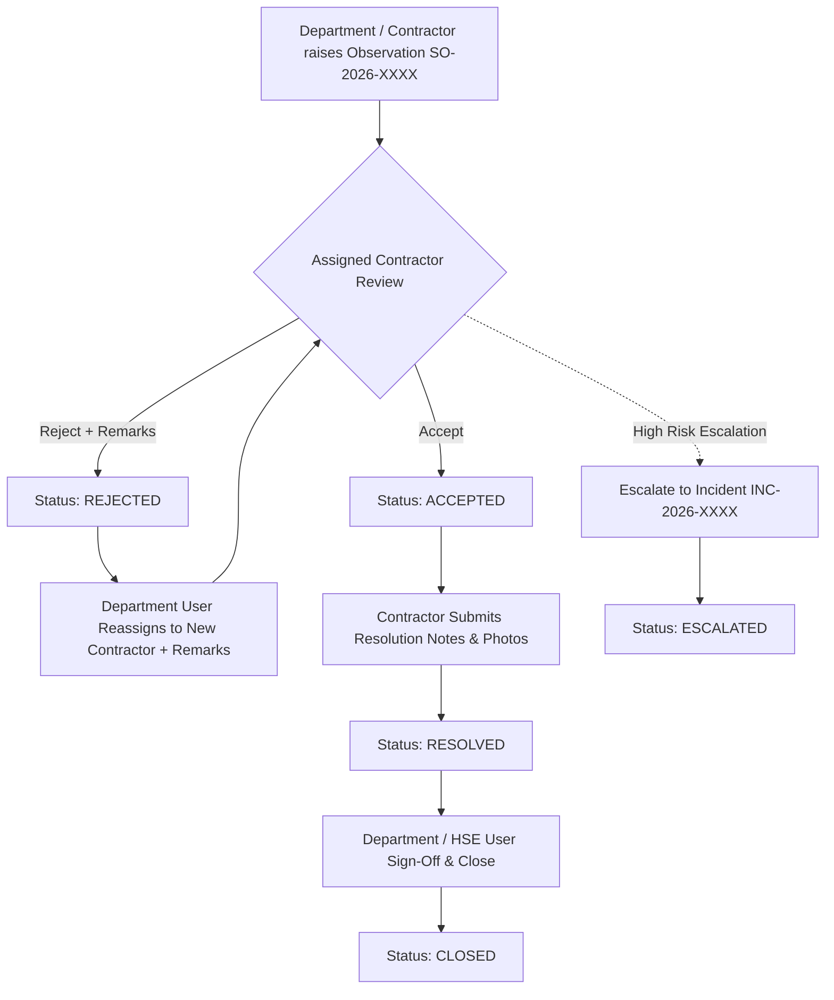

# 🚨 NNE SafetyHUB - Observations & Incidents Management API Documentation

This documentation provides a comprehensive guide for all **Safety Observations (SO)** and **Incident Management** REST APIs implemented in the `beam_south_backend` NestJS application per URS specification `URS-SAFETYTRACKER-OI-2026-001`.

---

## 📁 Postman Collections Location

- **Safety Observations Postman Collection**: [`postman/NNE_Observations_Management_Postman_Collection.json`](file:///d:/projects/Beam%20Projects%202.0/development/backend/beam_south_backend/postman/NNE_Observations_Management_Postman_Collection.json)
- **Incident Management Postman Collection**: [`postman/NNE_Incident_Management_Postman_Collection.json`](file:///d:/projects/Beam%20Projects%202.0/development/backend/beam_south_backend/postman/NNE_Incident_Management_Postman_Collection.json)

---

## 🔄 Safety Observations Lifecycle & Workflow



### 📋 Safety Observations REST APIs (`/observations`)

| Method | Endpoint | Description |
| :--- | :--- | :--- |
| **`POST`** | `/observations` | **Create Observation**: Creates `SO-2026-XXXX`. Supports direct photo uploads via Multer `multipart/form-data` or JSON body. |
| **`POST`** | `/observations/upload-images` | **Upload Photos**: Multer file upload into `./uploads/observations/`. |
| **`POST`** | `/observations/:id/contractor-review` | **Contractor Accept / Reject**: `action`: `ACCEPT` or `REJECT` + `remarks`. |
| **`POST`** | `/observations/:id/reassign` | **Department Reassign**: Reassigns to new contractor with justification `remarks`. |
| **`POST`** | `/observations/:id/resolve` | **Contractor Resolve**: Submits resolution notes & proof photos. |
| **`PUT`** | `/observations/:id/close` | **Department Sign-off & Close**: Closes observation with signature. |
| **`POST`** | `/observations/:id/escalate` | **Escalate to Incident**: Converts Observation into Stage 1 Incident (`INC-2026-XXXX`). |
| **`GET`** | `/observations/:id` | **Get Observation Details**: Returns observation + complete `history` timeline. |
| **`GET`** | `/observations` | **List Observations**: Scoped by contractor company (`userRole`, `contractorId`) + dropdown filters. |

---

## 📜 Audit Trail Timeline (`history: [...]`)

Every `GET /observations/:id` response returns the full audit log array detailing every accept, reject, reassignment, resolution, and closure action:

```json
{
  "observation": {
    "id": 1,
    "observationNumber": "SO-2026-0001",
    "status": "ASSIGNED",
    "assignedContractorName": "CKJ Steel"
  },
  "history": [
    {
      "actionType": "CREATED",
      "performedByUserName": "Sarah Jenkins (Site HSE Officer)",
      "performedByUserRole": "DEPARTMENT",
      "remarks": "Unguarded floor opening near AHU-04",
      "timestamp": "2026-08-20T17:00:00.000Z"
    },
    {
      "actionType": "CONTRACTOR_REJECTED",
      "performedByUserName": "David Miller (Give Steel Supervisor)",
      "performedByUserRole": "CONTRACTOR",
      "previousContractor": "Give Steel",
      "remarks": "Grating removal was executed by HVAC Piping subcontractor (CKJ Steel).",
      "timestamp": "2026-08-20T17:15:00.000Z"
    },
    {
      "actionType": "REASSIGNED",
      "performedByUserName": "Sarah Jenkins (Site HSE Officer)",
      "performedByUserRole": "DEPARTMENT",
      "previousContractor": "Give Steel",
      "newContractor": "CKJ Steel",
      "remarks": "Verified PTW #8824 - floor opening work belongs to CKJ Steel HVAC scope.",
      "timestamp": "2026-08-20T17:30:00.000Z"
    }
  ]
}
```

---

## ⏱️ Incident Investigation Pipeline APIs (`/incidents`)

| Stage | NNE Template | SLA | Primary API Endpoint |
| :--- | :--- | :--- | :--- |
| **Stage 1** | **Heads-Up Notification** | **< 2 Hours** | `POST /incidents/headsup` |
| **Stage 2** | **Initial Incident Report** | **< 24 Hours** | `POST /incidents/:id/initial-report` *(Multer form-data)* |
| **Stage 3** | **Incident Investigation Report** | **< 7 Days** | `PUT /incidents/:id/investigation` |
| **Close** | **Incident Closeout** | **-** | `PUT /incidents/:id/close` *(Requires Stage 3 sign-off AND all Action Items status = `COMPLETED`)* |

---

## 🛠️ Verification & Build Status
```powershell
cmd /c npm run build
```
Result: **Build Success (Exit Code 0)**.
